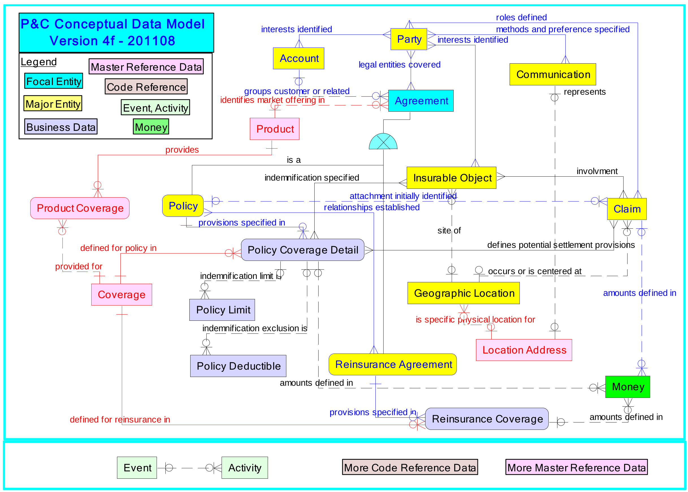

# Property Casualty Data Model (PCDM)

*Source: [casact/PCDM: Property Casualty Data Model Specification](https://github.com/casact/PCDM)*

Specification PDF: *PropertyCasualty-datamodel.pdf*

Part of the [CAS GitHub Organization - casact](CAS%20-%20Casualty%20Actuarial%20Society.md).

## Contents

* [Resources](Property%20Casualty%20Data%20Model.md#resources)
  * [Links](Property%20Casualty%20Data%20Model.md#links)
  * [Documents](Property%20Casualty%20Data%20Model.md#documents)
    * [PDF](Property%20Casualty%20Data%20Model.md#pdf)
* [Overview](Property%20Casualty%20Data%20Model.md#overview)
* [Schema](Property%20Casualty%20Data%20Model.md#schema)
* [Distribution](Property%20Casualty%20Data%20Model.md#distribution)
* [Installation and Deployment](Property%20Casualty%20Data%20Model.md#installation-and-deployment)
  * [PyPI](Property%20Casualty%20Data%20Model.md#pypi)
    * [Related](Property%20Casualty%20Data%20Model.md#related)

## Resources

### Links

* [casact/PCDM: Property Casualty Data Model Specification](https://github.com/casact/PCDM)
* [About the P&C Data Model For Property And Casualty Insurance Specification Version 1.0](https://www.omg.org/spec/PC/About-PC/)
* [No. 142 The Property Casualty Data Model Specification](https://genedan.com/no-142-the-property-casualty-data-model-specification/)
* [Book: database management systems](https://www.amazon.com/Modern-Database-Management-Jeffrey-Hoffer/dp/0136088392/ref=sr_1_4?dchild=1&keywords=modern+database+management&qid=1594612041&sr=8-4)

### Documents

* http://www.omg.org/spec/PC/1.0/Glossary
* http://www.omg.org/spec/PC/1.0/ConceptualDataModel
* http://www.omg.org/spec/DataModel.html.zip
* http://www.omg.org/spec/PC/1.0/LogicalDataModel.xls
* http://www.omg.org/spec/PC/1.0/PhysicalDataModel.xls

#### PDF


## Notes

A few weeks ago, I stumbled across something neat – the [Property Casualty Data Model (PCDM)](https://www.omg.org/spec/PC/About-PC/). PCDM is a relational database specification that covers all major parts of an insurance company’s operations. At first glance, the web page on which it is located seemed mundane to me, so I almost overlooked it, but when I opened the accompanying documentation, I realized I had stumbled upon a goldmine of useful information. This [document](https://www.omg.org/spec/PC/1.0/PDF) contains enough information to implement an entire data warehouse and then tweak it to an organization’s specific needs.

Although we actuaries have a reputation for being able to handle data, most of us have not received any kind of formal training in handling relational database systems, and have had little interaction with standards organizations outside of our own governing organizations like the CAS, SOA, and AAA. When I tried searching for PCDM in the CAS library, I was astonished to find just a handful of references to the specification, and flabbergasted that there had been a document floating around on another profession’s website for the last seven years that almost no actuaries had ever heard about, but contained the exact type of information that many actuaries wanted but thought had never existed in the public domain (and in my case, it contains more than what I need for parts of the MIES backend).

One benefit that I've had from working several jobs, and also as a consultant, is that I’ve been able to witness widely varying levels of maturity of data warehouse systems at commercial insurance companies of different sizes and functions (specialty, commercial, and reinsurance) as well as those of a major stock exchange to get some perspective of how insurance database implementations compare to those of other industries. I have seen many actuaries at small and midsize carriers struggle with how to create OLAP data warehouses, not knowing what tables, relationships, and fields to define, how to do it in a way that conforms to commonly accepted data management practices (if they even knew what they were), or even where to look or whom to talk to to find out what data are stored at the company, and in what form.

Earlier in my career, at a small insurer, a few years before this document existed, I would sometimes encounter databases with hundreds of undocumented tables, not knowing what any of the tables stored, if they were the right tables I needed, or if they were designed appropriately. I was one of the few actuaries in my department who knew [SQL](../2-Areas/Code/SQL/SQL.md) (and even then, I wasn't good at it). Embark upon the long journey of understanding insurance information systems.

In those days, the game kind of went like this. I would ask my boss if they knew anyone in IT, then I’d pick up the phone and call them to ask if they maintained the database I was looking at or knew of anyone who did or anyone who might know anyone who did. That chain of phone calls typically went 5 people deep until I finally reached someone who actually worked on the relevant database, and if I was lucky, they’d have some documentation, and I’d slowly figure out what kind of data I was working with.

## Overview

PCDM is a *SQLAlchemy* implementation of [Object Management Group's Property Casualty Data Model](https://www.omg.org/spec/PC/About-PC/). 

The [Property Casualty Data Model](Property%20Casualty%20Data%20Model.md) is a [relational database](Relational%20Databases.md) schema that closely resembles the backend of an insurance company. 

This package allows you to deploy a [SQLite](../3-Resources/Tools/Developer%20Tools/Data%20Stack/Databases/SQLite.md) database within seconds for testing, and can be tweaked to support [PostgreSQL](../3-Resources/Tools/Developer%20Tools/Data%20Stack/Databases/PostgreSQL.md) and other relational database systems.

## Schema

PCDM contains 256 tables from 13 [Subject Area Models (SAMs)](Subject%20Area%20Models.md):

1. **Party** - all persons, organizations, and groups involved in the insurance agreement
1. **Account and Agreement** - customer, insurer, and vendor agreements
1. **Policy** - policy information
1. **Claim** - claim information
1. **Assessment** - information pertaining to assesment (credit scoring, appraisals)
1. **Agreement Role** - roles involved in agreements (providers, producers, suppliers)
1. **Claim Role** - roles involved in claims (claimaints, adjusters)
1. **Staffing Role** - roles involved in staffing (employees and contractors)
1. **Party Subtype** - groupings and subgroupings of parties
1. **Insurable Object** - things that can be insured (vehicles, structures)
1. **Money** - transaction information
1. **Event** - event information
1. **Product** - product information (line of business, limits, coverage)



## Distribution

According to the [Object Management Group](https://www.omg.org/gettingstarted/overview.htm#Free):

 > 
 > Anyone can download specifications from the OMG website for free, write software implementations that conform to the specifications, and use them, give them away, or sell them. Neither OMG membership nor license is required for this.

## Installation and Deployment

This repository requires *sqlalchemy*, so install it if you don't have it:

````python
pip3 install sqlalchemy
````

or

````python
pip3 install -r requirements.txt
````

The file deploy_sqlite contains a script that can be used to deploy a SQLite database:

````bash
git clone https://github.com/genedan/PCDM
cd PCDM
python3 deploy_sqlite.py
````

### PyPI

This package is also available on PyPI:

````python
pip3 install pcdm
````

---

#### Related

* [Actuarial Science](../2-Areas/MOCs/Actuarial%20Science.md)
* [CAS - Casualty Actuarial Society](CAS%20-%20Casualty%20Actuarial%20Society.md)
* [Relational Databases](Relational%20Databases.md)
* [Subject Area Models](Subject%20Area%20Models.md)
* [PostgreSQL](../3-Resources/Tools/Developer%20Tools/Data%20Stack/Databases/PostgreSQL.md)
* [SQLite](../3-Resources/Tools/Developer%20Tools/Data%20Stack/Databases/SQLite.md)
* [Development](../2-Areas/MOCs/Development.md)
* [Databases](../2-Areas/MOCs/Databases.md)

*Backlinks:*

````dataview
list from [[Property Casualty Data Model]] AND -"Changelog"
````
